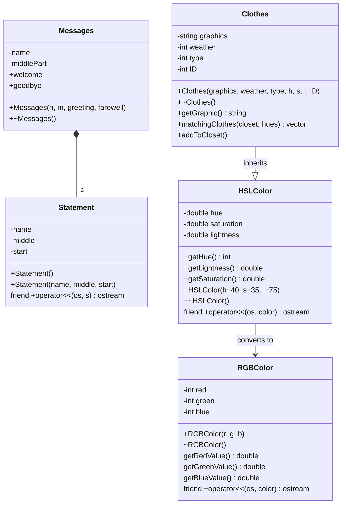

```mermaid
classDiagram

    class Statement {
        -name
        -middle
        -start
        +Statement()
        +Statement(name, middle, start)
        friend +operator<<(os, s) ostream
    }

    class Messages {
        -name
        -middlePart
        +welcome
        +goodbye
        +Messages(n, m, greeting, farewell)
        +~Messages()
    }

    class HSLColor {
        -double hue
        -double saturation
        -double lightness
        +getHue() int
        +getLightness() double
        +getSaturation() double
        +HSLColor(h=40, s=35, l=75)
        +~HSLColor()
        friend +operator<<(os, color) ostream
    }

    class Clothes {
        -string graphics
        -int weather
        -int type
        -int ID
        +Clothes(graphics, weather, type, h, s, l, ID)
        +~Clothes()
        +getGraphic() string
        +matchingClothes(closet, hues) vector
        +addToCloset()
    }

    class RGBColor {
        -int red
        -int green
        -int blue
        +RGBColor(r, g, b)
        ~RGBColor()
        getRedValue() double
        getGreenValue() double
        getBlueValue() double
        friend +operator<<(os, color) ostream
    }

    %% Relationships
    Messages *-- "2" Statement
    HSLColor --> RGBColor : converts to
    Clothes --|> HSLColor : inherits
```
