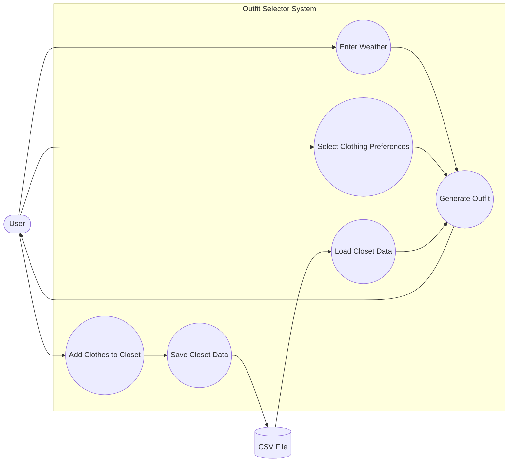

```mermaid
flowchart LR
    user([User])

    subgraph system["Outfit Selector System"]
        weather((Enter Weather))
        prefs((Select Clothing Preferences))
        add((Add Clothes to Closet))
        save((Save Closet Data))
        load((Load Closet Data))
        generate((Generate Outfit))
    end

    csv[(CSV File)]

    user --> weather
    user --> prefs
    user --> add

    weather --> generate
    prefs --> generate
    load --> generate

    add --> save
    save --> csv
    csv --> load

    generate --> user
```
